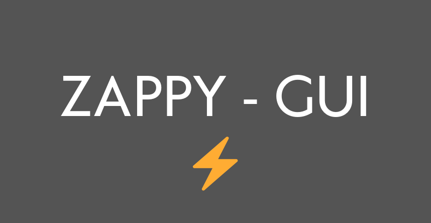

# Zappy Project - GUI Client Documentation 🌟



## Overview 📋

The Zappy project is a network game where multiple teams compete on a tile map filled with resources. The goal is for a team to have six players reach the highest level. This documentation details the architecture and functionality of the GUI client, which is written in C++ and uses the Raylib library for graphics and GTests for unit testing.

## Table of Contents 📚

1. [Introduction](#introduction)
2. [Architecture](#architecture)
    - [IException](#iexception)
    - [GUI Components](#gui-components)
        - [IObject](#iobject)
        - [AObject](#aobject)
        - [Position](#position)
        - [Game](#game)
        - [Display](#display)
        - [Events](#events)
        - [Tile](#tile)
        - [Trantorian](#trantorian)
        - [Team](#team)
        - [Action](#action)
        - [World](#world)
3. [Network](#network)
    - [Client](#client)
    - [ASocket](#asocket)
    - [TCPSocket](#tcpsocket)
    - [ProtocolHandler](#protocolhandler)
    - [CommandFactory](#commandfactory)
4. [Launching the GUI Client](#launching-the-gui-client)
5. [Authors](#authors)

## Introduction 🌐

The GUI client for the Zappy project connects to the server, displays the game world, and handles user interactions. It is designed to manage the game loop, rendering, and interactions seamlessly. The client is developed in C++ and leverages the Raylib library for graphics rendering and GTests for unit testing.

## Architecture 🏗️

### IException

Handles exceptions in the client, ensuring robust error management.

### GUI Components

#### IObject

An interface for all game objects.

#### AObject

Abstract base class for all objects, including food, stones, and eggs. Manages position and quantity.

#### Position

Manages the position of objects, including setters and getters for X and Y coordinates.

#### Game

Manages the main game loop, display, and events, coordinating the entire gameplay experience.

#### Display

Handles the window, tiles, Trantorians, objects, teams, eggs, stones, food, and menus.

#### Events

Manages mouse events, including interactions with tiles and Trantorians.

#### Tile

Represents tiles and includes functions to modify their content and position.

#### Trantorian

Represents Trantorians, managing their creation, 3D models, textures, position, orientation, and inventory.

#### Team

Represents teams, managing their Trantorians, number, and name.

#### Action

Represents actions performed by Trantorians, managing possible actions.

#### World

Represents the world, managing tiles and their content.

## Network 🌐

### Client

Manages the client connection to the server, handling connection, disconnection, and data transmission.

### ASocket

Abstract base class for sockets, defining essential socket operations.

### TCPSocket

Implements ASocket for TCP connections, managing connection, data transmission, and socket state.

### ProtocolHandler

Receives data and sends it to the CommandFactory for processing, ensuring proper handling of incoming data.

### CommandFactory

Creates and manages commands, directing them to the appropriate callbacks.

## Launching the GUI Client 🚀

To launch the GUI client, use the following command:

```
./zappy_gui -p port [-h hostname]
```

- `-p port`: Specifies the port number.
- `-h hostname`: (Optional) Specifies the server hostname. Defaults to `127.0.0.1`.

## Authors ✍️

- Made by: [@BxptisteM](https://github.com/BxptisteM) & [@Klayni](https://github.com/Klayni)

---

For more detailed information, refer to the project PDF documentation provided.
